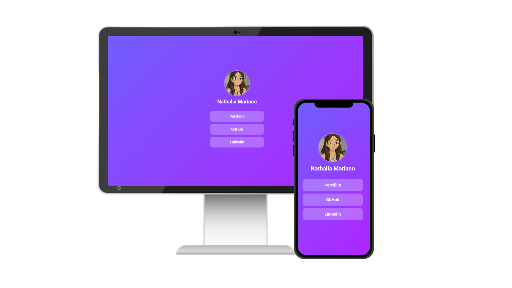

# 🌐 DEVLINK

Uma página pessoal estilo Linktree para reunir seus principais links, redes sociais e portfólio em um só lugar — com um visual moderno e responsivo.
[Acesse aqui!]([URL](https://nnathalia.github.io/Devlink/))

## ✨ Funcionalidades

- Layout responsivo com Bootstrap 5
- Foto de perfil e nome personalizados
- Lista de links dinâmica com JavaScript
- Botões estilizados com CSS personalizado

## 🧱 Tecnologias

- **HTML5**
- **CSS3**
- **JavaScript**
- **[Bootstrap 5](https://getbootstrap.com/)**

## 📁 Estrutura de Pastas

DEVLINK/
├── img/ # Imagens do projeto
│ ├── code.png # Icone
│ └── img-profile.jpg # Sua foto
├── index.html # Página principal
├── style.css # Estilos customizados e tema dark
├── script.js # Geração dinâmica dos links
└── README.md # Este arquivo

## 🚀 Como Usar

1. Clone ou baixe este repositório
2. Abra `index.html` no navegador
3. Altere os links dentro do `script.js` conforme suas redes e portfólio
4. Substitua a imagem `img/img-profile.jpg` pela sua foto
5. (Opcional) Publique no GitHub Pages, Vercel ou Netlify

## 📷 Preview

---

Criado por Nathalia Mariano 💜 — inspirado no estilo Linktree, com meu próprio toque!
